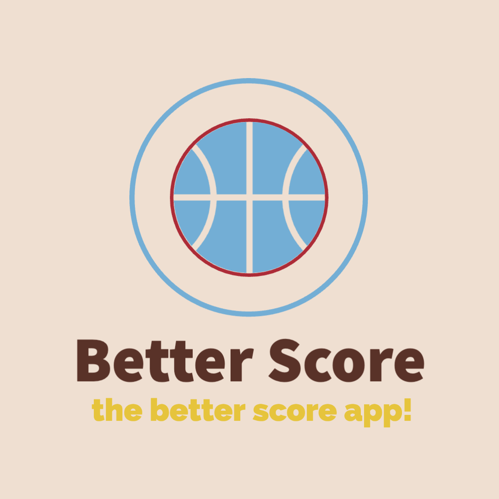
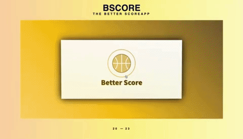

# Sport Tracker App



## Table of Contents
- [Introduction](#introduction)
- [Demo](#demo)
- [Technologies](#technologies)
- [Installation](#installation)
- [Features](#features)
- [Motivation](#motivation)
- [Future Improvements](#future_improvements)

## Introduction
Sport Tracker App is a full-fledged sports application designed to track and display the scores of the American League. The app utilizes web scraping techniques with Cheerio to gather data from sports-reference websites, allowing users to stay up-to-date with their favorite teams' scores and standings. This project has been a significant learning experience, as it was the first full-scale application developed from conception to deployment.

## Demo


## Technologies
The Sport Tracker App is built using the following technologies:
- Frontend: React with Tailwind CSS
- Backend: Node.js with Express
- Web Scraping: Cheerio

## Installation
To run the Sport Tracker App locally, follow these steps:

1. Clone the repository:
   ```bash
   git clone https://github.com/wdclem/SportTracker.git
   cd sport-tracker-app
   ```

2. ````
   npm start
   ```
3. enjoy navigating :
````
http://localhost:3000
````


## Features
Tracking of scores for the American League games.
User-friendly interface to view game results, team logos, and records.
Scraping data from sports-reference websites to fetch the latest information.
Responsive design for seamless usage on various devices.

## Motivation
This project was undertaken to gain hands-on experience in building a full-scale application from conception to deployment. The primary goal was to create a fully functional sports app focused on the American League, where users can easily access game scores and team information. Throughout the development process, the project served as a valuable learning experience, enhancing the following skills:

Understanding the importance of spending time on original design and defining a clear vision for the project.
Exploring various design directions and making informed decisions for the best user experience.
Gaining proficiency in web scraping techniques using Cheerio to retrieve sports data.
Mastering React for creating interactive and responsive front-end components.
Utilizing Tailwind CSS for streamlined and consistent UI design.
Learning to handle full-scale projects and dealing with potential challenges during development.

## Future Improvements
The Sport Tracker App has been an exciting journey, I intends to continue improving and adding new features in the future. Some of the planned enhancements include:

Implementing user authentication and personalized tracking.
Expanding coverage to other sports leagues.
Enhancing data visualization with charts and graphs.
Integrating real-time updates and notifications for game events.

## Credits
I express my gratitude to the developers and contributors of the following libraries and frameworks:

* React: https://reactjs.org/
* Tailwind CSS: https://tailwindcss.com/
* Cheerio: https://cheerio.js.org/
* Node.js: https://nodejs.org/
* Express: https://expressjs.com/
* Sport-reference : https://www.sports-reference.com/

Thank you for using the Sport Tracker App. If you have any questions or suggestions, please feel free to contact me. Happy tracking! 🏀🎉
